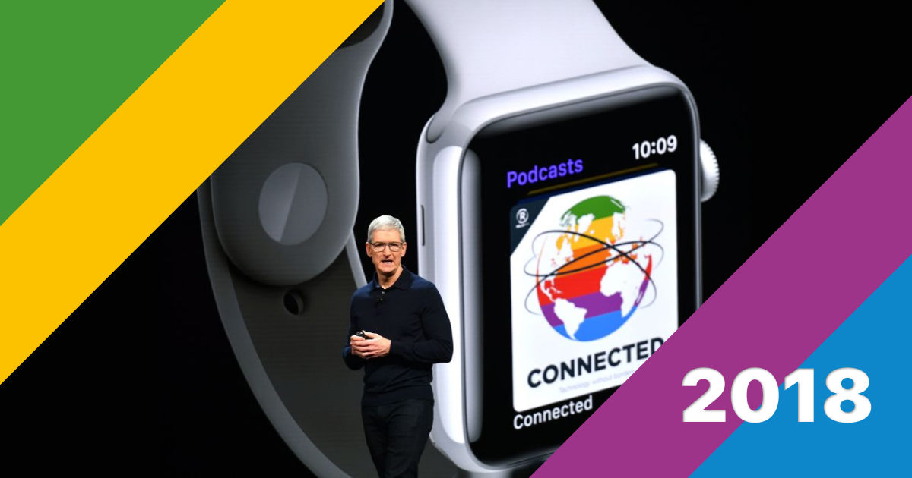
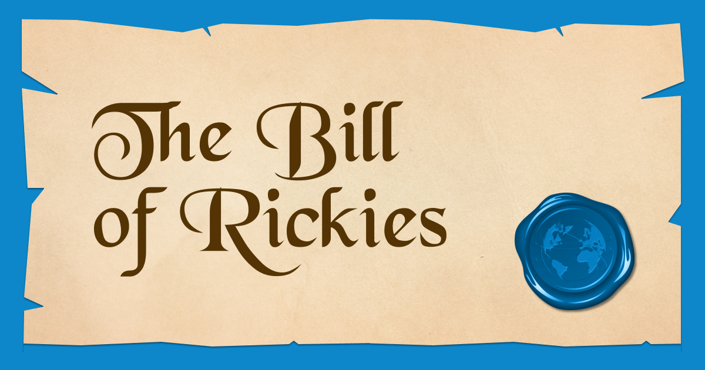
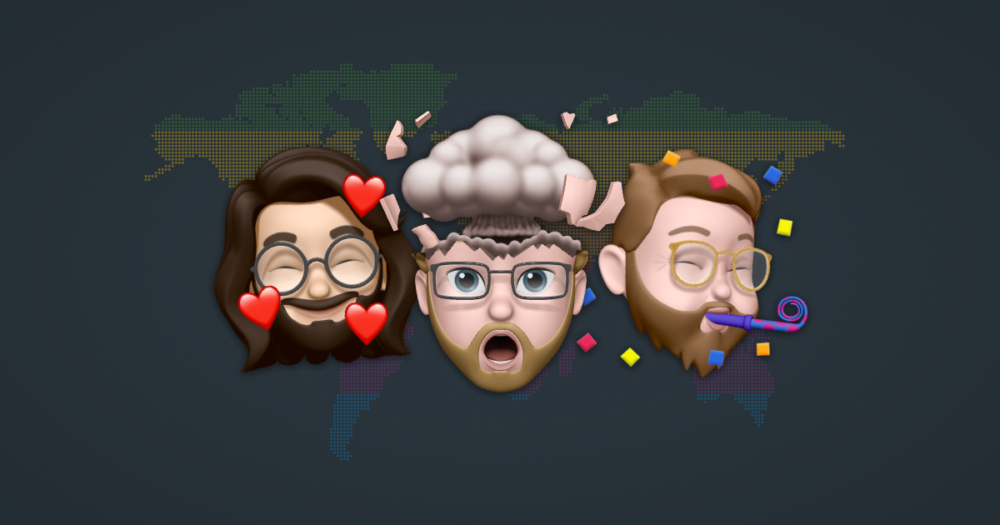
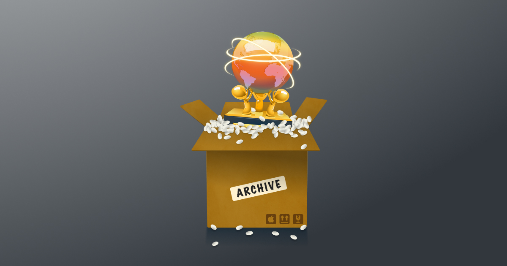
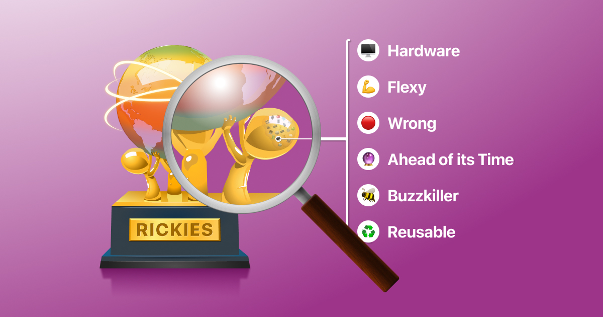
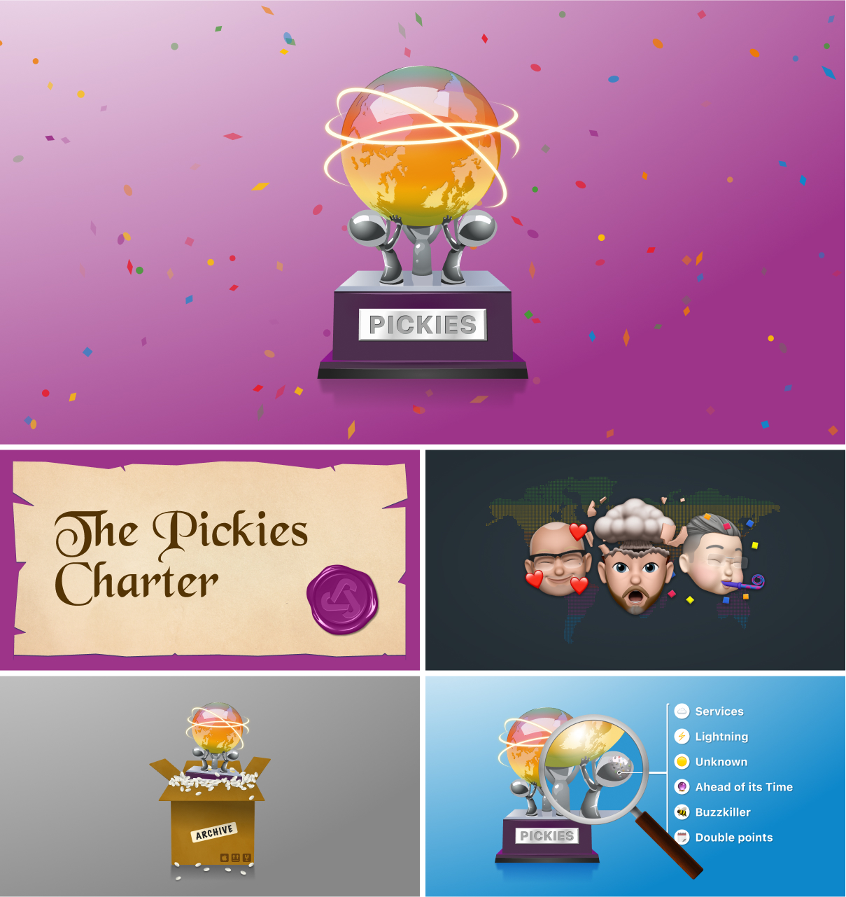

# Little Design Details

Below are several little details I’m proud of for this project. I just wanted to mention them somewhere for those that are interested.

## General

-   Avatars for each host cycle through a several Memoji randomly. They also have _different moods_ depending on the host’s ranking, and the background is a random Connected colour.
-   There’s a nice pop animation on many interactive items.
-   All dates on the website show relative time. So yesterday, today, and tomorrow, or the actual date.

## [Rickies overview](https://rickies.co/)

The main overview of all Rickies.

-   The Rickies trophy is custom designed, showing 3 hosts holding the coloured Connected globe.
-   When you first loaded the page, confetti is popped. After that, it waits for a while before popping again so you don’t get annoyed. Click/tap the trophy to manually pop the confetti.
-   The main menu on the [homepage](https://rickies.co) slowly cycles through the Connected colours. Same for some [list item graphics](https://rickies.co/about).
-   You can filter Rickies with a simple dropdown. The icon design is inspired by iOS Mail.
-   Rickies can have different statuses. [_Pre-Rickies_](https://rickies.co/annual-2018), [_Ungraded_](https://rickies.co/ungraded), _Awaiting show_ and even _Live_, they all have a little tags on the overview and a banner on the detail page.

## [Rickies details](https://rickies.co/latest)

Each Rickies has its own details page with all predictions, individual host stats and related data about charity donations, the Apple Event and the rules.

-   [Rickies detail pages](https://rickies.co/keynote-apr-2021) have a sticky menu that allow you to easily navigate to different sections. These sections are exclusive on mobile, and together on desktop.
-   For [ungraded and live Rickies](https://rickies.co/ungraded) the picks are **interactive**. When you change the state of a pick, the background changes so you see you edited it.
-   When you click/tap on the Rickies winner in the leaderboard at the top, confetti is popped.
-   Podcast episodes on the Rickies detail pages support [custom artwork](https://rickies.co/keynote-sep-2020#details). This also includes the switch from old white background to the new colourful one.
-   Rickies episode titles have a predefined format since [episode 259](https://www.relay.fm/connected/archive), but thanks to Connected Pro we got insight into what the title would have been in an alternative timeline. If it was mentioned in the post-show the alternative title is on the [Rickies detail page](https://rickies.co/keynote-jun-2021).
-   Terms like “Rickies”, “Flexies”, and “The Bill of Rickies” are different for earlier Rickies from before the terms were coined, e.g. “Bragging rights”.
-   Some H1 titles have custom CSS to match the style of the header image, e.g. the Rickies for [April 2020](https://rickies.co/keynote-apr-2021), [September 2020](https://rickies.co/keynote-sep-2020) and [June 2019](https://rickies.co/keynote-jun-2019).
-   I love playing with the search open/close button in the top right corner.

## [The Bill of Rickies](https://rickies.co/billof)

The continuously changing rules that guide the Rickies, with the complete history of amendments.

-   The rules changed over time, and so does the document. New rules get added, old ones removed. Sometimes text even changes within a rule.
-   [The Bill of Rickies](https://rickies.co/billof/annual-2017) document, including titles, styling, and [links to it](https://rickies.co/annual-2017#details), changes dependent on the date of the Rickies. To reflect when terms like Rickies, Flexies and The Bill of Rickies were coined.
-   There’s a button to play The Bill of Rickies theme music. It changes the icon between play and pause, but it also gets a fixed position while playing so you can always easily pause again.
-   The favicon changes between [The Rickies](https://rickies.co/) pages and [The Bill of Rickies](https://rickies.co/billof).
-   I can’t stop playing with the button to open and close the slider, especially on mobile.

## [Host Leaderboard](https://rickies.co/leaderboard)

See the hosts’ latest statistics, including an interactive timeline.

### [Statistics](https://rickies.co/leaderboard#stats)

-   Aside from Chairman titles, most titles on the leaderboard are randomised. Refresh a few times to see the inside japes.
-   Nice donut charts to show the ratio of correct, wrong and unknown predictions, with hover state per section.
-   Click/tap the Chairman title holder avatars to pop some confetti again.
-   Many statistics were added with v2.0, like how far a host was ahead of its time, how he performs with a coin flip and what his favourite and most successful categories are.
-   The sub navigation shows timeline and stats, but on mobile it replaces stats with items for each host for easier navigation.
-   Charts now have a new purple section too, for wrong picks that came true after they were scored. Many of Stephen’s **Risky** picks came true later.
-   Note the little animations on some emoji, like the flipping coin and the pulsing orb of “ahead of its time”.

### [Chairman timeline](https://rickies.co/leaderboard#timeline)

-   The Chairman timeline shows which host was a chairman when and for how long.
-   There are 2 tracks per host, for Annual and Keynote Chairman, so you can easily see how the title has moved.
-   When the chairman bubble touched the host avatar, a ring is shown to indicate they were the chairman during that time. This show both titles together, and also the Mega Chairman (both titles).
-   Tap the legend to show or hide one of the tracks. Enjoy the bouncy animation.
-   You zoom in and out to change your overview.
-   Scroll left/right to see past title on the timeline, or drag of that’s more your thing.

## [Rickies archive](https://rickies.co/archive)

The complete archive of all predictions ever made during the Rickies.

-   Visible metadata includes:
    -   [Prediction age](https://rickies.co/?search=&reusable=on#results) and whether it can be reused or not.
    -   [Buzzkiller](https://rickies.co/?search=&buzzkiller=on#results), was it a negative pick.
    -   [Ahead of its time](https://rickies.co/?search=&ahead_of_its_time=on#results), picks that were wrong when scored, but came true later. And how and when did you come true.
    -   Did the pick require [adjudication](https://rickies.co/?search=&adjudicated=on#results)?
    -   Was the [Bill of Rickies amended](https://rickies.co/?search=&amendment=on&#results) because of this pick
    -   What [categories](https://rickies.co/?search=&display=&category%5B%5D=hardware#results) does a pick fall into.
-   The archive and search results are basically the same page, just with less content. When you have an actual query, and the Archive menu item as a little reset arrow to the return to “all picks”.
-   Note the little animations on some emoji, like when you hover on a pick and it is or is not reusable.

## [Search on Rickies](https://rickies.co/?search=promotion)

Search and filter all metadata of all Rickies and Flexies.

-   Full filtering of all predictions
    -   All of the metadata from the archive above
    -   “Everything in the prediction document must come true, no half point may be awarded.” But [what if there were half points awarded](https://rickies.co/?search=&half_points=on#results)?
    -   [Prediction type](https://rickies.co/?search=&pick_type%5B%5D=risky#results) (regular, Risky, Flexy)
    -   [Prediction result](https://rickies.co/?search=&status%5B%5D=correct&#results) (correct, wrong, unknown)
    -   [Picks by host](https://rickies.co/?search=&host%5B%5D=federico#results)
    -   Picks by event or [event type](https://rickies.co/?search=&rickies_event=wwdc#results)
-   The charts at the top depict the actual search results below. This makes it easy to compare the host’s performances based on your interest. And there’s a combined chart on the right.
-   Notice all the little animations and UI changes when opening/closing the filters, or when resizing the window.
-   Did you notice the hosts are sleeping when there are no results for them?
-   On touch devices the filter checkboxes have bigger touch target for improved tappability.
-   Categories have multiple levels. At the top level there are Hardware, Software, Service and People. More specific levels below are also visible.
-   For some categories there’s even a level below that, but those are not visible by default because it’d be too much. But when you filter on those by clicking on a category below a pick, [they become visible](https://rickies.co/?search=&category%5B%5D=ipad-mini&category%5B%5D=imac&category%5B%5D=display#results).
-   You can choose what metadata you want visible on the overview:
    -   [All metadata](https://rickies.co/archive) (default)
    -   [Just the picks](https://rickies.co/?search=&display=clean#results) with no extra metadata
    -   [Only the categories](https://rickies.co/?search=&display=categories#results)
    -   [Only the age and reusability](https://rickies.co/?search=&display=age#results)

## [The Pickies](https://rickies.co/pickies)

Full support for the Pickies holiday special with Jason, John, and James.

-   The main navigation completely changes when viewing the Pickies.
-   You can always go back to the Rickies with the little trophy on the right.
-   The menu items change size depending on your screen size, e.g. from “Leaderboard^3J” to “Triple J Leaderboard”.
-   The Pickies trophy is similar to the Rickies trophy, only silver instead of gold to match the Triple J’s grey style. Also the base has a different colour and the glove is upside down.
-   Predictions for [Annual Pickies 2022](https://rickies.co/annual-2022-special) were completed. There’s now support for Lightning Rounds and double points.
-   There’s a custom Pickies Charter avatar at the bottom of the page.

### [The Pickies Charter](https://rickies.co/charter)

-   The Pickies Charter has all the rules for the Pickies and of course it has full historical support for the latest amendments.
-   Custom “historical” rules set, because the history is lost to time.
-   The seal has of the 3J logo.

### [Triple J Leaderboard](https://rickies.co/3j-leaderboard)

-   Memoji for all the new hosts, Jason, John, and James.
-   New randomised titles for each.
-   Charts for regular and lightning picks.
-   If you look real close at the dotted world map, you’ll see the dots have moved to the locations of the Triple J.

### [Pickies archive and search](https://rickies.co/3j-archive)

-   A new little checkbox in the hosts corner. Toggle it to switch hosts and related filters
-   New filters for:
    -   Picks by the [Triple J](https://rickies.co/?search=&3j=on#results), [Jason](https://rickies.co/?search=&host%5B%5D=jason&3j=on#results), [John](https://rickies.co/?search=&host%5B%5D=john&3j=on#results), and [James](https://rickies.co/?search=&host%5B%5D=james&3j=on#results)
    -   Picks from [Pickies](https://rickies.co/?search=&3j=on&pick_type%5B%5D=picky#results) and [Lightning Round](https://rickies.co/?search=&3j=on&pick_type%5B%5D=lightning#results)
    -   Picks with [double points](https://rickies.co/?search=&3j=on&double_points=on#results) because they came true in the first half of the year

## [About Rickies.co](https://rickies.co/about)

-   The icons for the GitHub links cycled through the Connected colours with a random starting point, with across the list they’re always in rainbow order.
-   I had to get the artwork for The Prompt in this website somewhere. Haha, goal achieved.
-   Other incredible fan efforts are all mentioned too.
-   Twitter, YouTube, and GitHub [links](https://rickies.co/about#more_fan_efforts) have a little logo.
-   The MagTricky image randomises between the different chairman magnets.

## (Standalone) web app

Rickie.co is optimised as a web app and takes advantage of many native features.

-   Add the site to you homescreen to get the best experience, with a nice app icon, splash screen, and no browser chrome. A screen filled with Rickies content.
-   When added to your homescreen, there is also no share button from the browser anymore. So I added a share button to the top corner, but only in standalone mode. And it opens the native share sheet you already know. If your OS does not support this, it will fall back to a simple “copy URL” action.
-   The website has support for the safe areas on your devices (like the iPhones with notch). So you don’t get big black bars at top and bottom, even when you add it to your home screen.
-   Full support for the system light and dark mode.
-   When added to and opened from the homescreen, you can pull to refresh the page.
-   The rubber banding over-scroll at both the top and bottom background colour matches the content of the page itself and feels more native when installed as a web app.
-   Hover states are only present on devices that support hover, so mobile devices respond faster and don’t leave a hover state behind after you tap them. This was done with a relatively new feature `@media (hover: hover)`.
-   Fully responsive design with items moving from [columns to rows](https://rickies.co/leaderboard) on wider screens.
